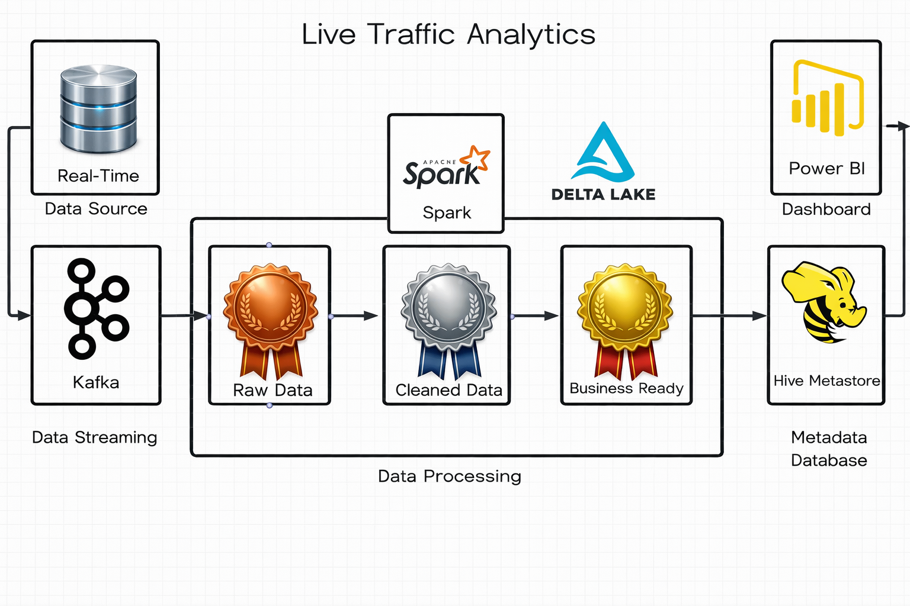

# 🚦 Live Traffic Analytics Pipeline

## 📌 Overview

This project implements a **real-time traffic analytics pipeline** using modern data engineering tools. It simulates live traffic data using **Faker**, streams it through Kafka, processes it with Spark, and visualizes insights in Power BI.

The system follows a **Lakehouse architecture** with structured layers:
**Raw → Cleaned → Business-ready**

---

## 🏗️ Architecture


### 🔄 Data Flow:

1. **Faker (Python)** → Generates real-time traffic data
2. **Kafka Producer** → Sends streaming data
3. **Apache Kafka** → Handles real-time ingestion
4. **Apache Spark (Structured Streaming)** → Processes data
5. **Delta Lake** → Stores data in layers
6. **Hive Metastore** → Manages metadata
7. **Power BI** → Dashboard visualization

---

## ⚙️ Tech Stack

* **Data Generation:** Faker (Python)
* **Streaming:** Apache Kafka
* **Processing:** Apache Spark (Structured Streaming)
* **Storage:** Delta Lake
* **Metadata:** Hive Metastore
* **Visualization:** Power BI
* **Orchestration (optional):** Apache Airflow
* **Containerization:** Docker & Docker Compose

---

## 🧪 Data Simulation (Faker)

Traffic data is simulated using the **Faker** library to mimic real-world scenarios.

### Example Fields:

* Vehicle ID
* Timestamp
* Location (lat, long)
* Speed
* Traffic Density
* Road Type


## 🗂️ Data Layers

| Layer             | Description                |
| ----------------- | -------------------------- |
| 🥉 Raw Data       | Unprocessed Kafka stream   |
| 🥈 Cleaned Data   | Filtered & structured data |
| 🥇 Business Ready | Aggregated insights        |

---

## 🚀 Getting Started

### 1️⃣ Clone the Repository

```bash
git clone https://github.com/your-username/your-repo.git
cd your-repo
```

### 2️⃣ Start Infrastructure

```bash
docker-compose up -d
```

### 3️⃣ Run Kafka Producer (Faker Data)

```bash
python producer.py
```

### 4️⃣ Run Spark Streaming Job

```bash
spark-submit streaming_job.py
```

---

### Example Insights:

* 🚗 Traffic volume trends
* ⏱️ Peak congestion hours
* 📍 Location-based traffic patterns

---

## 📁 Project Structure

```
.
├── producer/          # Faker-based Kafka producer
├── spark/             # Spark streaming jobs
├── delta/             # Delta Lake tables
├── airflow/           # DAGs (optional)
├── docker-compose.yml
└── README.md
```

## 🔮 Future Enhancements

* Add ML model for traffic prediction 🚀
* Real-time alerting system (accidents/congestion)
* Deploy on AWS / Azure
* Integrate geospatial analytics

---

## 👤 Author

**Sudhanshu Pukale**
Data Engineer 🚀
